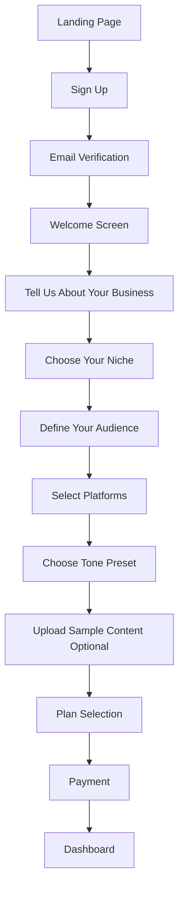
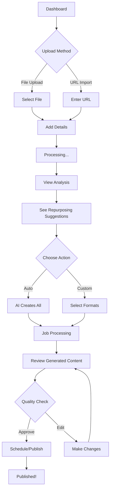
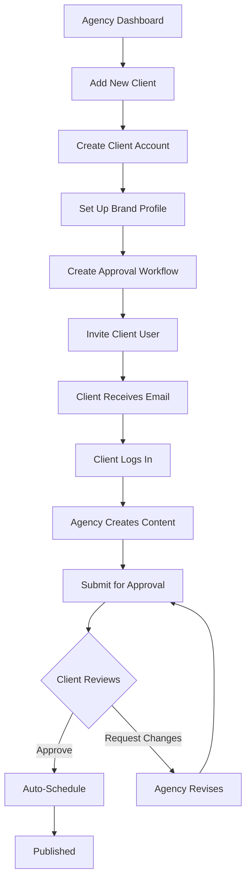
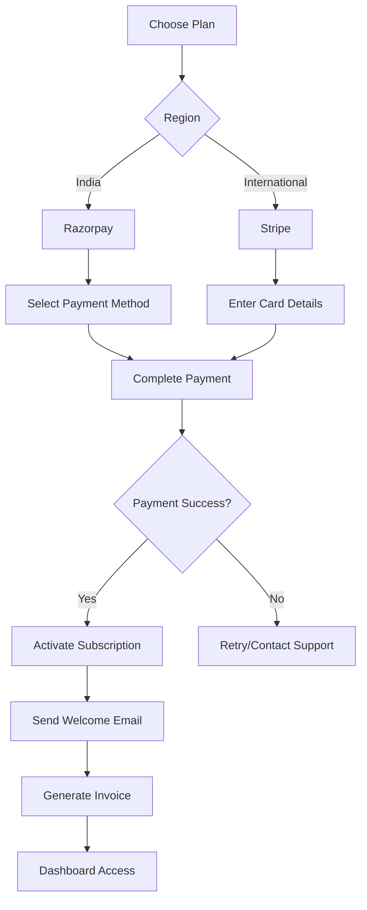

# 🎯 User Flows & Journey Maps

## Overview
This document outlines detailed user flows for all key user personas and feature interactions.

---

## User Personas

### 1. Solo Creator (Rahul - YouTuber from Mumbai)
- **Goals:** Maximize content reach, save time
- **Pain Points:** Too much manual work, inconsistent posting
- **Tech Savvy:** Medium

### 2. Marketing Agency (Sarah - Agency Owner, UK)
- **Goals:** Scale client services, maintain quality
- **Pain Points:** Too many clients, approval bottlenecks
- **Tech Savvy:** High

### 3. Brand Manager (Priya - Enterprise, Bangalore)
- **Goals:** Maintain brand consistency, ROI tracking
- **Pain Points:** Multiple stakeholders, compliance
- **Tech Savvy:** Medium

---

## Core User Flows

## Flow 1: New User Onboarding



### Step-by-Step Flow

#### Step 1: Registration
- **Screen:** Sign Up Page
- **User Actions:**
  - Enter email, password, full name
  - Select country (India/International)
  - Optional: Enter referral code
  - Click "Create Account"
- **System Actions:**
  - Validate email format
  - Check if email already exists
  - Hash password
  - Send verification email
  - Create user account (status: pending)
- **Next:** Email verification screen

#### Step 2: Email Verification
- **Screen:** Verification Pending
- **User Actions:**
  - Check email inbox
  - Click verification link
- **System Actions:**
  - Verify token
  - Activate account
  - Log user in
  - Redirect to onboarding
- **Next:** Welcome screen

#### Step 3: Business Profile
- **Screen:** Tell Us About Your Business
- **User Actions:**
  - Select business type (Individual Creator, Agency, Brand/Company)
  - Enter business name
  - Select industry (20+ options)
  - Describe in one sentence (optional)
- **System Actions:**
  - Create organization profile
  - Set default settings based on selections
- **Next:** Niche selection

#### Step 4: Niche & Audience
- **Screen:** Choose Your Niche
- **User Actions:**
  - Select primary niche (Tech, Finance, Health, Lifestyle, etc.)
  - Select sub-niches (multi-select)
  - Define target audience:
    - Age range
    - Gender
    - Location(s)
    - Interests
- **System Actions:**
  - Store audience profile
  - Generate personalized recommendations
- **Next:** Platform selection

#### Step 5: Platform Preferences
- **Screen:** Which Platforms Do You Use?
- **User Actions:**
  - Select platforms (multi-select):
    - ✅ YouTube
    - ✅ Instagram
    - ✅ LinkedIn
    - ✅ TikTok
    - ✅ Twitter/X
    - ✅ Facebook
  - Mark primary platform
- **System Actions:**
  - Store platform preferences
  - Unlock platform-specific features
- **Next:** Tone selection

#### Step 6: Brand Voice
- **Screen:** Choose Your Brand Tone
- **User Actions:**
  - Select tone preset:
    - **Professional** (Corporate, B2B)
    - **Casual** (Friendly, conversational)
    - **Viral** (Trendy, engaging)
    - **Hinglish** (India-specific mix)
    - **Custom** (Define your own)
  - View examples for each tone
  - Optional: Upload 2-3 sample posts/content
- **System Actions:**
  - Create brand profile
  - If samples uploaded: Queue AI voice analysis
  - Generate brand voice parameters
- **Next:** Plan selection

#### Step 7: Choose Plan
- **Screen:** Select Your Plan
- **User Actions:**
  - Review plan features
  - Select plan (Creator/Pro/Agency)
  - Choose billing period (Monthly/Yearly - save 20%)
  - Click "Continue to Payment"
- **System Actions:**
  - Calculate pricing based on region
  - Show applicable taxes (GST for India)
  - Prepare payment gateway
- **Next:** Payment

#### Step 8: Payment
- **Screen:** Checkout
- **India Users:**
  - Razorpay modal opens
  - Select: UPI / Cards / Net Banking
  - Complete payment
- **International Users:**
  - Stripe checkout opens
  - Enter card details
  - Complete payment
- **System Actions:**
  - Process payment
  - Activate subscription
  - Send confirmation email
  - Generate invoice
- **Next:** Dashboard

#### Step 9: Dashboard Welcome
- **Screen:** Dashboard (First Time)
- **User Actions:**
  - See welcome tutorial overlay
  - Click "Take a Tour" or "Skip"
- **System Actions:**
  - Show product tour (6 key features)
  - Display sample templates
  - Show "Upload Your First Content" CTA
- **Next:** Ready to use!

**Total Time:** 5-8 minutes  
**Drop-off Prevention:** Progress bar, skip options, save & continue later

---

## Flow 2: Content Upload → Repurposing → Publishing



### Detailed Steps

#### Phase 1: Upload Content

**Screen:** Content Library → Upload Button

**Option A: File Upload**
1. Click "Upload Content"
2. Drag & drop or browse file
   - Supported: Video (MP4, MOV), Audio (MP3, WAV), Documents (PDF, DOCX), Images
   - Max size: 2GB (Creator), 5GB (Pro), 10GB (Agency)
3. Upload progress bar shown
4. Add metadata:
   - Title (auto-suggested from filename)
   - Description
   - Select brand profile
   - Add tags
5. Click "Upload & Analyze"

**Option B: URL Import**
1. Click "Import from URL"
2. Paste URL (YouTube, LinkedIn, Instagram, etc.)
3. System fetches metadata automatically
4. Preview shown
5. Confirm import

#### Phase 2: AI Analysis

**Screen:** Processing → Analysis Results

**Processing (takes 30-60 seconds):**
- Extract audio (if video)
- Run speech-to-text transcription
- Detect topics & keywords
- Identify hook moments
- Calculate scores:
  - Virality potential
  - Repurposing value
  - Platform fit scores
  - SEO score (for text)

**Analysis Results Screen:**
```
📊 Content Analysis

Original: "My 30-Min Podcast on AI Marketing"
Type: Audio | Duration: 28:35 | Size: 45 MB

🎯 Key Insights:
- Topics: AI, Marketing, Content Strategy, Automation
- Sentiment: Positive (85/100)
- Energy Level: High
- 8 Hook Moments Detected

💡 Repurposing Recommendations:
✅ High Priority (Do These First!)
  - 8x Short Videos (Instagram Reels, TikTok)
  - 5x LinkedIn Posts
  - 1x Blog Article (2,500 words)
  
⭐ Medium Priority
  - 10x Quote Cards (Instagram, LinkedIn)
  - Twitter Thread (12 tweets)
  - Newsletter Email

📈 Estimated Reach: 50,000+
⏱️ Processing Time: ~15 mins
💰 Credits Cost: 120 credits
```

#### Phase 3: Choose Repurposing Strategy

**Screen:** Repurposing Options

**User Sees:**
1. **Quick Start (Recommended)**
   - "Create All High Priority Content"
   - One-click, AI decides everything
   - Fastest option
   
2. **Custom Selection**
   - Choose specific formats
   - Configure each format:
     - Number of pieces
     - Aspect ratios
     - Caption styles
     - Platform targeting
   
3. **Save Strategy for Later**
   - Add to content calendar
   - Schedule repurposing

**User Selects:** "Create All High Priority Content"

#### Phase 4: AI Repurposing

**Screen:** Processing Dashboard

**Real-time Updates:**
```
🔄 Creating Your Content...

✅ Completed (3 of 14)
🔄 In Progress:
   - Generating Instagram Reel #4 (75% done)
   - Current step: Adding animated captions
   
⏳ Queued:
   - 7x more short videos
   - 5x LinkedIn posts
   - 1x blog article

⏱️ Estimated Time Remaining: 8 minutes
```

**WebSocket Updates:** Live progress bar, no refresh needed

#### Phase 5: Review Generated Content

**Screen:** Review & Edit

**Generated Content Library:**
```
📹 8 Short Videos Created

[Thumbnail] Instagram Reel #1
"5 AI Tools That Will 10x Your Marketing"
⏱️ 58 seconds | 9:16 (Vertical)
✨ Virality Score: 92/100
📝 Caption: "AI is transforming marketing... [Read More]"
🏷️ #AIMarketing #ContentStrategy #MarketingTips

[Actions]
✏️ Edit | 📅 Schedule | 📤 Publish Now | ⬇️ Download
```

**User Can:**
- Preview each piece
- Edit caption, hashtags, CTA
- Regenerate with different style
- Delete unwanted pieces
- Download files

#### Phase 6: Schedule & Publish

**Option A: Schedule All**
1. Click "Schedule All"
2. View AI-recommended times:
   ```
   Instagram Reels:
   - Reel #1: Mon, Feb 12, 9:00 AM (Best time: 95% score)
   - Reel #2: Wed, Feb 14, 6:00 PM (Best time: 92% score)
   ```
3. Accept or customize times
4. Click "Confirm Schedule"
5. Done! Content will auto-publish

**Option B: Publish Now**
1. Select content
2. Choose platform(s)
3. Click "Publish Now"
4. System publishes immediately
5. Shows platform links

**Option C: Download**
1. Select content
2. Click "Download All"
3. ZIP file downloads
4. Use elsewhere

**Success Screen:**
```
🎉 Success! Your Content is Scheduled

✅ 8 Instagram Reels: Scheduled
✅ 5 LinkedIn Posts: Scheduled
✅ 1 Blog Article: Ready to publish (manual)

📅 Calendar View | 📊 Track Performance | ✅ Done
```

**Total Flow Time:** 
- Upload to ready: 10-15 minutes
- Hands-on time: 3-5 minutes (rest is AI processing)

---

## Flow 3: Agency Client Management



### Detailed Agency Flow

#### Step 1: Add Client
**Screen:** Clients → Add New Client

**Input Fields:**
- Client name
- Contact email
- Contact phone
- Industry
- Brand colors (hex codes)
- Logo upload

**System Creates:**
- Client account
- Isolated workspace
- Default settings

#### Step 2: Set Up Brand Profile
**Screen:** Client Brand Setup

**Agency Fills:**
- Brand voice tone
- Target audience
- Content goals
- Platform preferences
- Upload brand assets (logos, fonts, templates)

**AI Action:**
- Analyzes brand guidelines
- Creates voice profile
- Suggests content strategy

#### Step 3: Create Workflow
**Screen:** Approval Workflow Setup

**Agency Defines:**
```
Workflow: "Standard Client Approval"

Stage 1: Internal Review
- Approvers: [Agency Manager]
- Auto-approve after: 24 hours (optional)

Stage 2: Client Review  
- Approvers: [Client Contact]
- Required: Yes
- Deadline: 48 hours

Stage 3: Final Publish
- Action: Auto-publish if Stage 2 approved
```

#### Step 4: Daily Operations

**Agency Creates Content:**
1. Upload client's source content
2. Repurpose using AI
3. Review outputs
4. Click "Submit for Client Approval"

**Client Receives:**
- Email notification
- Dashboard notification
- WhatsApp notification (optional)

**Client Portal View:**
```
📋 Content Pending Your Approval (5 items)

[Preview] Instagram Reel #1
Title: "New Product Launch Teaser"
Preview: [Video plays]
Caption: "Exciting news coming soon! 🚀..."
Scheduled: Feb 15, 10:00 AM

Actions:
✅ Approve | 🔄 Request Changes | ❌ Reject
```

**Client Approves:**
- System auto-schedules
- Agency gets notification
- Content publishes on time

**Client Requests Changes:**
- Adds feedback: "Change caption tone to more professional"
- Agency gets notification
- Agency revises
- Resubmits for approval

#### Step 5: White-Label Experience

**If Agency has White-Label plan:**
- Client sees: "clients.yourgenacy.com"
- Branding: Agency logo, not RepurposeX
- Emails: From agency@youragency.com
- Client thinks agency built the software!

---

## Flow 4: Payment & Subscription Management

### New Subscription



### Upgrade Flow

**User on Creator Plan → Wants Pro**

1. **Dashboard:** Banner shows "Upgrade to Pro for unlimited uploads!"
2. **Click "Upgrade Now"**
3. **Comparison Screen:**
   ```
   Current: Creator (₹999/month)
   Upgrade to: Pro (₹2,999/month)
   
   You'll Get:
   ✅ 50 uploads/month (vs 10 now)
   ✅ All platforms (vs 5 now)
   ✅ Priority AI processing
   ✅ Advanced analytics
   
   Prorated Charge Today: ₹1,800
   Next Billing Date: March 10 (₹2,999)
   ```
4. **Click "Upgrade & Pay"**
5. **Payment processed**
6. **Instant access to Pro features**

### Cancellation Flow

1. **Settings → Subscription → Cancel**
2. **Cancellation Survey:**
   ```
   We're sorry to see you go 😢
   
   Why are you canceling?
   ○ Too expensive
   ○ Not using enough
   ○ Missing features
   ○ Technical issues
   ○ Other: ___________
   
   [Offer based on reason]
   → "Too expensive": "Get 30% off for 3 months?"
   → "Not using": "Need help? Talk to our team?"
   ```
3. **If still cancel:**
   ```
   ✅ Cancellation Scheduled
   
   Your subscription will remain active until: March 10, 2026
   You'll retain access to all features until then.
   
   No further charges will be made.
   
   We hope to see you back! ❤️
   ```

---

## Flow 5: Analytics & ROI Tracking

**Screen:** Analytics Dashboard

**User Journey:**

1. **Access:** Dashboard → Analytics tab

2. **Overview (Default View):**
   ```
   📊 Last 30 Days Performance
   
   📈 Content Created: 45 pieces (+25% vs last month)
   👁️ Total Views: 125,000 (+45%)
   💬 Total Engagement: 8,500 (+32%)
   📱 Reach: 85,000 unique users
   
   [Line graph showing daily trends]
   ```

3. **Platform Breakdown:**
   ```
   By Platform:
   
   Instagram: 35 posts | 45K views | 7.1% engagement ⭐ Top Performer
   LinkedIn: 28 posts | 38K views | 7.4% engagement
   TikTok: 20 posts | 32K views | 5.8% engagement
   YouTube: 8 videos | 28K views | 4.2% engagement
   ```

4. **Top Performing Content:**
   ```
   🏆 Your Best Performers
   
   1. [Thumbnail] "5 AI Marketing Hacks"
      Instagram Reel | 12K views | 950 likes
      
   2. [Thumbnail] "LinkedIn Growth Strategy"
      LinkedIn Post | 8.5K views | 680 engagements
   ```

5. **ROI Analysis (Pro Plan+):**
   ```
   💰 Content ROI Analysis
   
   Source: "Podcast Episode #45"
   Original Time Investment: 5 hours
   Cost Value: ₹5,000
   
   Repurposed Into: 25 pieces
   Total Reach: 75,000
   Total Engagement: 5,200
   Estimated Value: ₹37,500
   
   ROI Multiplier: 7.5x 🚀
   Cost per Engagement: ₹0.96
   
   💡 Insight: Your podcast content has 7.5x better ROI than creating individual social posts!
   ```

6. **Export Reports:**
   - Click "Generate Report"
   - Choose: PDF, Excel, or PowerPoint
   - Customizable date range
   - White-label option (Agency plan)
   - Download or email

---

## Mobile Experience Flow

**All flows optimized for mobile:**

1. **Mobile-First Design:** Touch-optimized buttons, swipe gestures
2. **Progressive Web App:** Install on home screen
3. **Offline Mode:** View content, draft edits offline
4. **Quick Actions:**
   - Upload via camera
   - Approve content on-the-go
   - View notifications
5. **Native Apps (Planned):**
   - iOS & Android apps (Month 12)
   - Push notifications
   - Better video handling

---

## Error & Edge Case Flows

### Payment Failed
```
❌ Payment Failed

Your payment could not be processed.

Reason: Insufficient funds

What now?
1. Try another payment method
2. Contact your bank
3. Try again in a few hours

[Retry Payment] [Contact Support]
```

### Upload Failed
```
⚠️ Upload Failed

File: "my-video.mp4" (2.5 GB)
Error: File size exceeds your plan limit (2GB)

Solutions:
1. Compress your video
2. Upgrade to Pro (5GB limit)
3. Split into smaller files

[Compress File] [Upgrade Plan]
```

### Job Failed
```
❌ Processing Failed

Job: "Video to Shorts"
Error: Video format not supported

We've automatically refunded your credits.

What to do:
1. Convert video to MP4
2. Try uploading again
3. Contact support if issues persist

[Upload Again] [Get Help]
```

---

**All user flows designed for:**
- ✅ Minimal clicks (< 3 for common actions)
- ✅ Clear error messages with solutions
- ✅ Progress indicators for long processes
- ✅ Undo/cancel options
- ✅ Mobile optimization
- ✅ Accessibility (WCAG 2.1 AA)

**User Satisfaction Target:** NPS > 50, 5-star rating > 4.5
